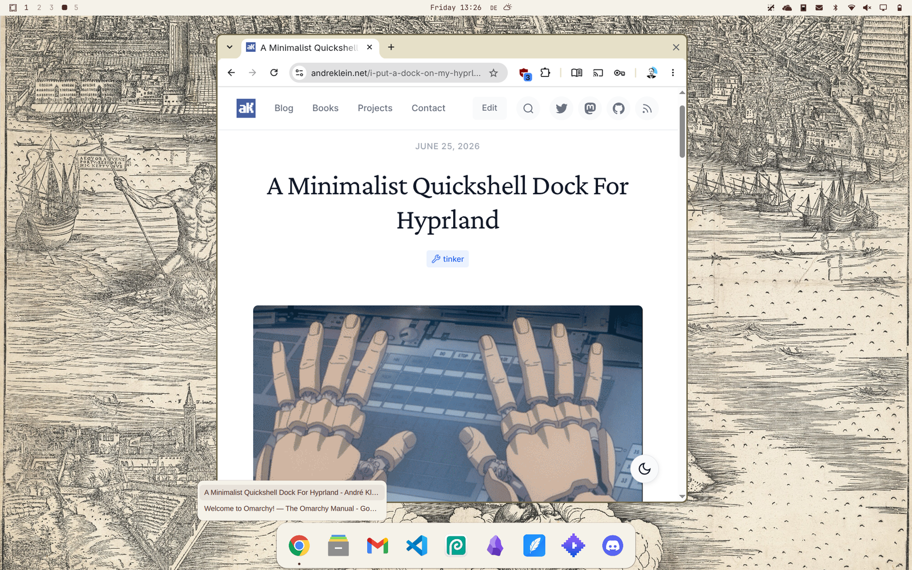

# Stealth Dock



An auto-hiding dock for [Omarchy](https://omarchy.org/), built on Quickshell. Launches your pinned apps, tracks running windows, and most importantly **gets out of your way** when you don't need it. Instead of a timer or hover toggle, hide/show is driven by what's actually on your workspace: empty workspace → dock is visible. Windows present → dock hides. Event-driven, workspace-aware.

The scope is deliberately tight: no window thumbnails, no subprocess tracking. Just a fast launcher that knows when to be there and when to vanish — with icons you can drag into whatever order you like.

## Install (Omarchy)

```
omarchy plugin add https://github.com/burninc0de/burninc0de.dock.git --enable
```

That clones the plugin into `~/.config/omarchy/plugins/burninc0de.dock` and starts it. Verify with `omarchy plugin list` — it should show up as `burninc0de.dock`, enabled.

## Update / Disable / Uninstall

```sh
omarchy plugin update burninc0de.dock    # pull the latest version
omarchy plugin disable burninc0de.dock   # stop it, keep it installed
omarchy plugin enable burninc0de.dock    # bring it back
omarchy plugin remove burninc0de.dock    # delete it
```

Uninstalling leaves your data alone: pins, drag order and removed apps live in
`~/.local/state/omarchy/burninc0de.dock/` (`pins.json`, `order.json`, `hidden.json`), so reinstalling puts everything back
exactly as it was. Delete that folder for a factory reset. If you are updating from an older version that used
`~/.local/state/quickshelldock/`, your data is migrated automatically on first launch.

## Not on Omarchy?

The dock is a plain Quickshell shell and runs on any Hyprland setup:

- [Quickshell](https://quickshell.outfoxxed.me/) (runtime)
- Hyprland 0.55+ (uses the `hl.dsp.focus()` dispatcher syntax)

```
quickshell -p /path/to/burninc0de.dock
```

Auto-start from your Hyprland Lua config:

```lua
o.exec_on_start("quickshell -p /path/to/burninc0de.dock")
```

Or if you're still on hyprlang:

```
exec-once = quickshell -p /path/to/burninc0de.dock
```

## Caveats

- **Multiple Quickshell instances** &mdash; Quickshell doesn't support running multiple independent shells well. If you already have another Quickshell-based panel or bar, this dock will likely conflict. Test in an isolated Hyprland session first.
- **One dock per machine** &mdash; make sure only one copy of the plugin is installed. A leftover clone under a different plugin id (e.g. an old `zeno.dock`) runs a second dock on top of this one.

## Configuration

Copy `config/UserConfig.example.qml` to `config/UserConfig.qml` and edit it to customize your apps. Both files are in the plugin directory so Quickshell's native hot reload picks up changes instantly, no restart needed.

`UserConfig.qml` is gitignored, so your personal config stays out of the repo. Without one, the defaults in `config/DockApps.qml` apply.

### App entry fields

| Field         | Required | Description |
|---------------|----------|-------------|
| `name`        | yes      | Display name |
| `icon`        | yes      | Icon name (theme) or absolute path to an image |
| `cmd`         | yes      | Shell command to launch (split on whitespace; arguments with spaces aren't supported) |
| `match`       | no       | Match running windows by title substring |
| `appId`       | no       | Match running windows by Wayland appId |
| `minimizable` | no       | Default `true`. When `false`, clicking a running app always focuses it instead of minimize/restore |

### Window matching

If no `match` or `appId` is set, the dock extracts the binary name from `cmd` and compares it against the app's `appId` and `class`.

Fields come straight out of the app's `.desktop` file: `Icon=` → `icon`, `Exec=` → `cmd`, `StartupWMClass=` → `appId`.

### showOnFloating

When `true`, workspaces that contain only floating windows are treated as empty (dock stays visible). Default: `true`.

## Adding apps

Four ways, in increasing order of convenience.

**Edit the config.** `config/UserConfig.qml` is the declarative base and hot-reloads on save.

**Pin from the command line.**

```sh
bin/quickshelldock-pin chromium        # pin by desktop entry id
bin/quickshelldock-pin --unpin chromium
bin/quickshelldock-pin --list
```

It reads the `.desktop` file for you, strips launcher field codes (`%U`, `%f`, …) out of `Exec=`, and appends the app
to `$XDG_STATE_HOME/omarchy/burninc0de.dock/pins.json` (`~/.local/state/omarchy/burninc0de.dock/pins.json` by default). The dock watches that file, so the icon appears immediately. Symlink
the script into `~/.local/bin` to have it on `PATH`.

**Pin from the Omarchy menu (Super+Space).** Run `integration/install-omarchy-menu-rightclick` once, then right-click
any app in the menu to pin or unpin it. See [`integration/`](integration/) for what that touches and how to undo it.
Without the patch you can still add a `Dock › Pin app to dock` row to `~/.config/omarchy/extensions/omarchy-menu.jsonc`
pointing at `quickshelldock-pin --pick`, which needs no changes to Omarchy at all.

**Pin straight from the dock.** Right-click any empty spot on the bar: every running app that isn't on the dock yet
shows up in a small list — click one to pin it. Under the hood this uses `--pin-window`, which resolves the window's
class/appId back to a desktop entry (by file id, `StartupWMClass` or `Exec` basename) so the pinned icon launches
properly. A fresh install therefore needs no config editing at all: defaults ship in, everything else is
right-click pin/unpin.

Pins layer on top of `UserConfig.qml` rather than replacing it, and an app already declared there is not duplicated.

## Right-click menu

Right-clicking a dock icon offers the three actions every other dock agrees on — GNOME's dash-to-dock, the macOS Dock
and KDE's task manager all share them:

| Action | Shown |
|--------|-------|
| Open new window | always |
| Quit | only while the app is running; closes all of its windows |
| Unpin from dock | always |

Window lists, thumbnails and "App Details" are deliberately absent — they belong to the scope this dock doesn't have.

Right-clicking an **empty spot on the bar** instead of an icon opens a different menu: running apps that aren't
pinned yet, ready to be pinned (see [Adding apps](#adding-apps)).

Unpin works on every icon, wherever it came from. Apps pinned with the tool are dropped from `pins.json`; apps
declared in `UserConfig.qml` are recorded in `hidden.json` instead, because rewriting your hand-written QML isn't the
dock's business. A hidden app isn't on the dock any more, so bring it back with `--restore-pick` (or the
`Dock › Restore removed app` menu row):

```sh
bin/quickshelldock-pin --list-hidden
bin/quickshelldock-pin --restore Obsidian
```

Right-clicking the app in the Super+Space menu also restores it, as long as the dock's display name matches the
desktop entry's `Name=`. Where you renamed it in `UserConfig.qml` — a "foot" entry labelled "Terminal", say — use
`--restore` with the dock's name.

## Hover window list

Hovering an icon whose app has **two or more** windows open pops a small list of them after a short delay. Clicking
an entry focuses that window and hides the dock, same as clicking the icon itself does. Single-window apps skip the
list — clicking the icon goes straight to the window.

## Reordering

Drag an icon sideways to move it. The remaining icons shuffle out of the way as you go, and the order is written to
`$XDG_STATE_HOME/omarchy/burninc0de.dock/order.json` (`~/.local/state/omarchy/burninc0de.dock/order.json` by default) on release, so it
survives a restart.

The saved order takes priority over the order apps are declared in the config. Apps added to the config afterwards
are appended to the end of the dock; apps removed from the config are dropped. Delete `order.json` to fall back to
the config order.

## Show / hide

Visibility is driven by the workspace, not by timers: empty workspace → dock visible; windows present → dock hidden.
Hiding waits 500ms after the pointer leaves so moving between the dock and the bottom edge doesn't flicker, and both
show and hide slide over 200ms. Hovering the bottom edge reveals the dock at any time.

The only other easing is the 120ms shuffle of icons displaced by a drag; set that `NumberAnimation` duration to `0`
in `DockPanel.qml` if you want reordering to snap too.

## Minimize / Restore

Since Hyprland has no native minimize, clicking a running app's dock icon hides it on the `special:dock_minimize` scratchpad workspace. Clicking again restores it to the current workspace.

This works for any app that has toplevels on the current workspace. Apps on other (non-special) workspaces are focused normally. Set `minimizable: false` per app to disable this behavior.

## Badges

A red unread counter is shown above apps whose window title contains an `Inbox (N)` marker (Gmail webapps). It's
driven by Hyprland `windowtitle` events, so it updates without polling.

## Workspace detection

The dock uses a two-tier approach: `Hyprland.toplevels` (fast, via `rawEvent`) covers the common cases: empty workspace keeps the dock visible, occupied hides it. When `showOnFloating` is enabled and toplevels exist, it falls back to `hyprctl clients -j` to check whether only floating windows are present, since the Quickshell API doesn't expose a `floating` flag on toplevels.

## Project structure

```
├── Dock.qml             entrypoint, one DockPanel per screen
├── manifest.json        Omarchy plugin manifest (id: burninc0de.dock)
├── DockPanel.qml        dock UI, auto-hide, window matching, menus
├── bin/
│   └── quickshelldock-pin     pin/unpin CLI (sole writer of pin state)
├── integration/               Omarchy Super+Space menu patch
└── config/
    ├── DockApps.qml            config singleton
    ├── UserConfig.qml          your personal config (gitignored)
    └── UserConfig.example.qml  example to copy
```
